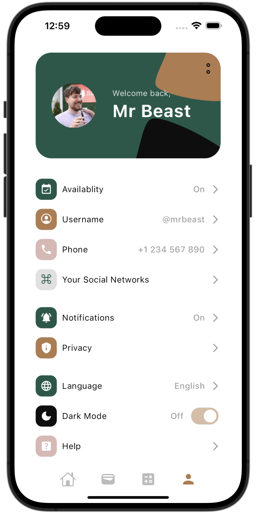

## Collection of UIs made in Flutter

### Drop a start ⭐️ to show appreciation. Thanks

# 1. Books Arena
### [Credits](https://dribbble.com/shots/24116590-eBook-Mobile-App)
  

# 2. Meditate and Heal
### [Credits](https://dribbble.com/shots/24037088-Meditation-app-design-mobile-app)
  

# 3. BioSphere
### [Credits](https://dribbble.com/shots/23304929-BioSphere-Mobile-App-Concept)
https://github.com/justkawal/UI/assets/49296873/d18d3df0-424f-4646-a9eb-43bd716106b4

# 4. Book Store
### [Credits](https://dribbble.com/shots/23184080-Book-Store-Mobile-Concept)
   

# 5. Dating App
### [Credits](https://dribbble.com/shots/23309894-Dating-app-design-mobile-app)
  

# 6. Music Player
### [Credits](https://dribbble.com/shots/9338617-Simple-Music-Player)
 

# 7. Sun Glasses Store
### [Credits](https://dribbble.com/shots/22836673-E-commerce-mobile-app)
  

# 8. Banking
### [Credits](https://dribbble.com/shots/7285975-Warren-Splash-Investment-Category)
  
 
  

# 9. Architect UI
  

# 10. Furniture Store
  
