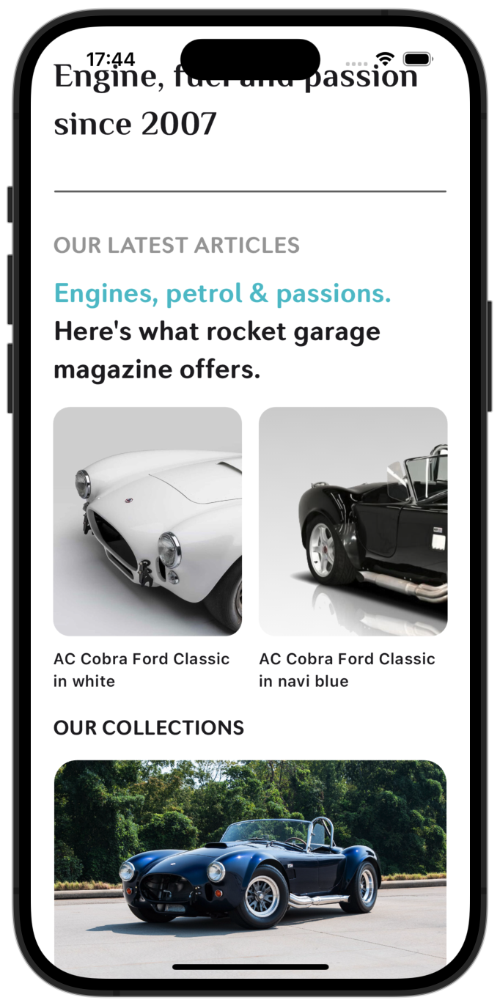
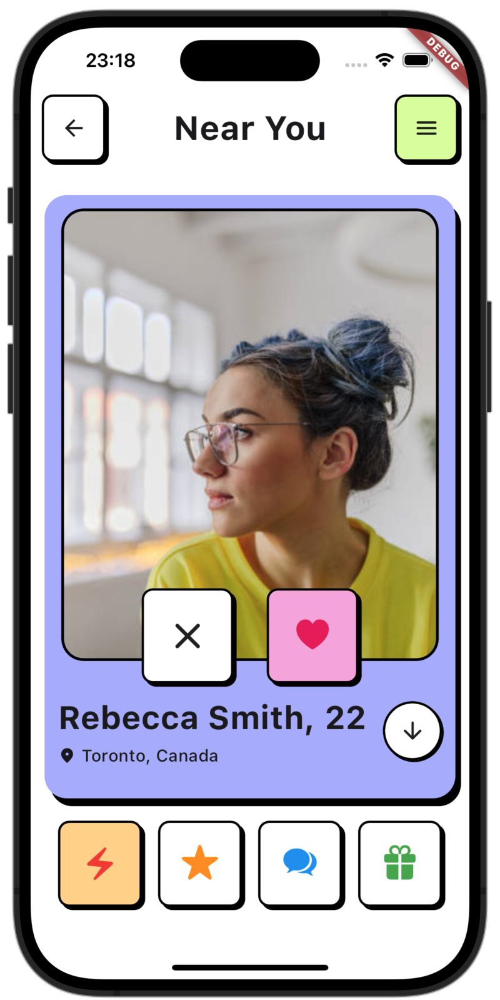

## Collection of UIs made in Flutter

## Hi, I'm looking for a Flutter Developer job, if your company has one. Please refer or help me out. I'm currently located in Toronto, Ontario, Canada.... Thanks your help matters....
### Please hit the star ⭐️ to show appreciation. Thanks!!

# 1. Finances App (Day 12 of 30, UI challenge)
### [Designer Credits](https://dribbble.com/shots/21652377-Finance-service-Mobile-app)
  

# 2. Education Dashboard Flutter Desktop (Day 11 of 30, UI challenge)
### [Designer Credits](https://dribbble.com/shots/24505736-Online-Education-App-Design)

# 3. Wellbeing App (Day 10 of 30, UI challenge)
### [Designer Credits](https://dribbble.com/shots/24102638-Meditation-Mobile-App)
  

# 4. Databest App (Day 9 of 30, UI challenge)
### [Designer Credits](https://dribbble.com/shots/20676640-Databest-Mobile-App-Design-iOS-Android-UX-UI-Designer)
  

# 5. Classic Ford App (Day 8 of 30, UI challenge)
### [Designer Credits](https://dribbble.com/shots/23302025-Ford-Classic)
  

# 6. Range Rover App (Day 7 of 30, UI challenge)
### [Designer Credits](https://dribbble.com/shots/22562451-Jerez-App-Electrical-and-Crypto-Driven-Car)
 

# 7. Sales Dashboard Flutter Desktop (Day 6 of 30, UI challenge)
### [Designer Credits](https://dribbble.com/shots/24573449-Sales-Dashboard)

# 8. EV Dashboard App (Day 5 of 30, UI challenge)
### [Designer Credits](https://dribbble.com/shots/23693275-Tesla-Mobile-App-Concept)
 

# 9. Tesla App (Day 4 of 30, UI challenge)
### [Designer Credits](https://dribbble.com/shots/24365934-EV-Station-Charge-and-Profile-Screen-Design-Friday-Tech-Labs)
   

# 10. Banking App (Day 3 of 30, UI challenge)
### [Designer Credits](https://dribbble.com/shots/24030587-Banking-Mobile-App)
  

# 11. Journeys (Day 2 of 30, UI challenge)
### [Designer Credits](https://dribbble.com/shots/23963293-Travel-Booking-Mobile-App-UI)
  

# 12. Power Grid (Day 1 of 30, UI challenge)
### [Designer Credits](https://dribbble.com/shots/24230360-MYGRID-Smart-AI-Mobile-App)
  

# 13. Books Arena
### [Designer Credits](https://dribbble.com/shots/24116590-eBook-Mobile-App)
  

# 14. Meditate and Heal
### [Designer Credits](https://dribbble.com/shots/24037088-Meditation-app-design-mobile-app)
  

# 15. BioSphere
### [Designer Credits](https://dribbble.com/shots/23304929-BioSphere-Mobile-App-Concept)
https://github.com/justkawal/UI/assets/49296873/d18d3df0-424f-4646-a9eb-43bd716106b4

# 16. Book Store
### [Designer Credits](https://dribbble.com/shots/23184080-Book-Store-Mobile-Concept)
   

# 17. Dating App
### [Designer Credits](https://dribbble.com/shots/23309894-Dating-app-design-mobile-app)
  

# 18. Music Player
### [Designer Credits](https://dribbble.com/shots/9338617-Simple-Music-Player)
 

# 19. Sun Glasses Store
### [Designer Credits](https://dribbble.com/shots/22836673-E-commerce-mobile-app)
  

# 20. Banking
### [Designer Credits](https://dribbble.com/shots/7285975-Warren-Splash-Investment-Category)
  
 
</a>  

# 21. Architect UI

# 22. Furniture Store

