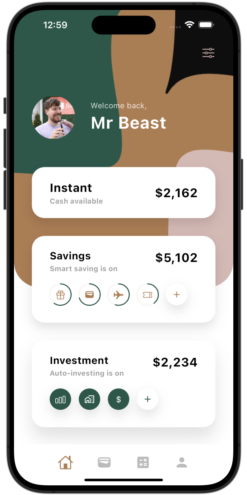

## Collection of UIs made in Flutter

### Please hit the star ⭐️ to show appreciation. Thanks!!

# 1. Sales Dashboard Desktop App (Day 6 of 30, UI challenge)
### [Designer Credits](https://dribbble.com/shots/24573449-Sales-Dashboard)

# 2. EV Dashboard App (Day 5 of 30, UI challenge)
### [Designer Credits](https://dribbble.com/shots/23693275-Tesla-Mobile-App-Concept)
 

# 3. Tesla App (Day 4 of 30, UI challenge)
### [Designer Credits](https://dribbble.com/shots/24365934-EV-Station-Charge-and-Profile-Screen-Design-Friday-Tech-Labs)
   

# 4. Banking App (Day 3 of 30, UI challenge)
### [Designer Credits](https://dribbble.com/shots/24030587-Banking-Mobile-App)
  

# 5. Journeys (Day 2 of 30, UI challenge)
### [Designer Credits](https://dribbble.com/shots/23963293-Travel-Booking-Mobile-App-UI)
  

# 6. Power Grid (Day 1 of 30, UI challenge)
### [Designer Credits](https://dribbble.com/shots/24230360-MYGRID-Smart-AI-Mobile-App)
  

# 7. Books Arena
### [Designer Credits](https://dribbble.com/shots/24116590-eBook-Mobile-App)
  

# 8. Meditate and Heal
### [Designer Credits](https://dribbble.com/shots/24037088-Meditation-app-design-mobile-app)
  

# 9. BioSphere
### [Designer Credits](https://dribbble.com/shots/23304929-BioSphere-Mobile-App-Concept)
https://github.com/justkawal/UI/assets/49296873/d18d3df0-424f-4646-a9eb-43bd716106b4

# 10. Book Store
### [Designer Credits](https://dribbble.com/shots/23184080-Book-Store-Mobile-Concept)
   

# 11. Dating App
### [Designer Credits](https://dribbble.com/shots/23309894-Dating-app-design-mobile-app)
  

# 12. Music Player
### [Designer Credits](https://dribbble.com/shots/9338617-Simple-Music-Player)
 

# 13. Sun Glasses Store
### [Designer Credits](https://dribbble.com/shots/22836673-E-commerce-mobile-app)
  

# 14. Banking
### [Designer Credits](https://dribbble.com/shots/7285975-Warren-Splash-Investment-Category)
  
 
  

# 15. Architect UI
  

# 16. Furniture Store
  
