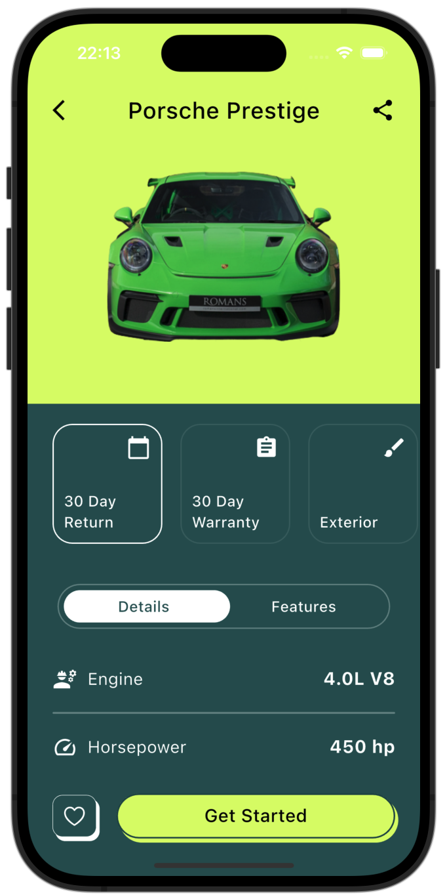
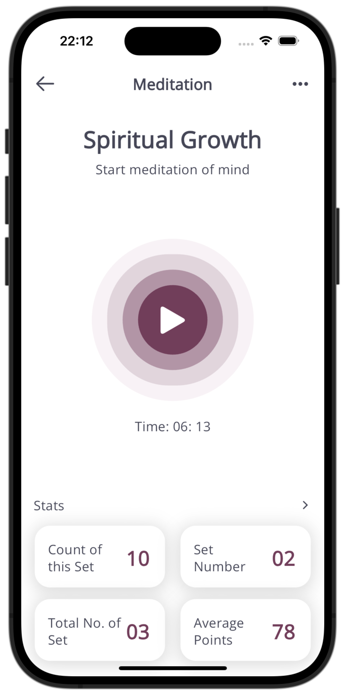
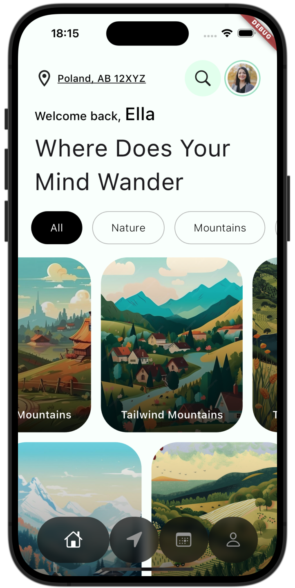
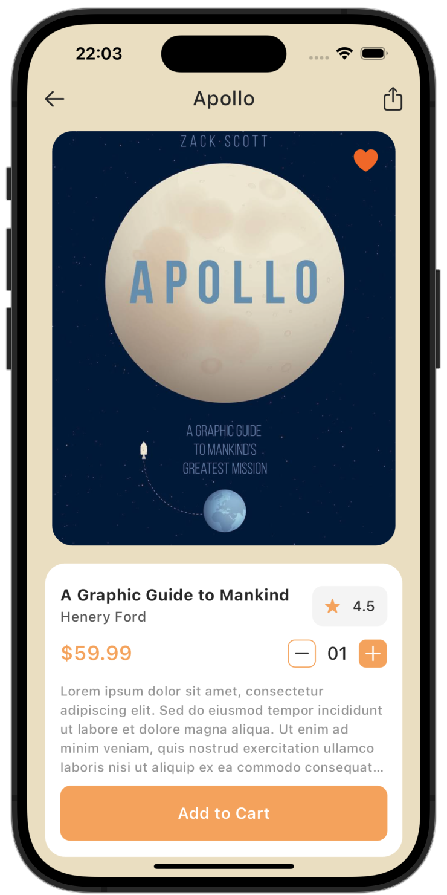
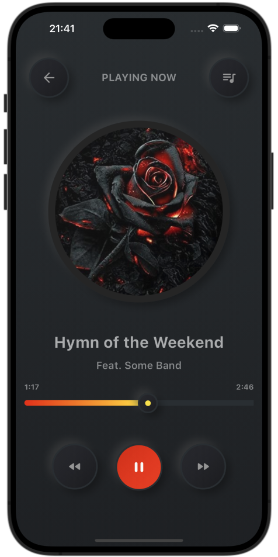
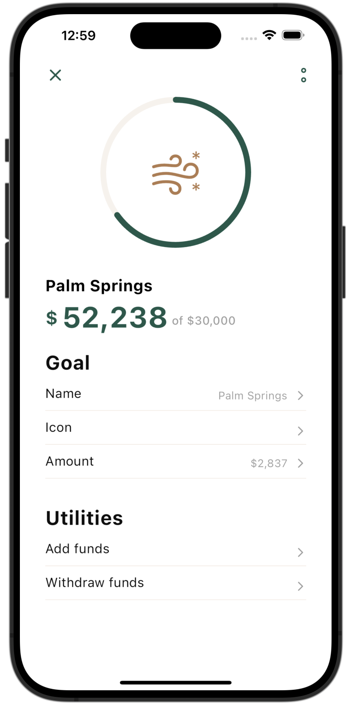

## Collection of UIs made in Flutter

### Please hit the star ⭐️ to show appreciation. Thanks!!

# Ongoing: Flutter Challenge (1 - 30 Aug, 2024)
### Everyday, I speed-code a design in Flutter and share on linkedin and here with flutter community to help developers and get feedback, and to grow together.

                                                                               

## Flutter Desktop 🫠
 

# Hi 👋, Currently...
## I'm looking for a Flutter Developer job, and is based in Ontario, Canada. Please refer me if possible. Thank you, your help really matters ❤️....

# 1. Socialize Chats App (Day 22 of 30, UI challenge)
### [Designer Credits](https://dribbble.com/shots/24005518-Dating-Mobile-App)
 

# 2. Dating App (Day 21 of 30, UI challenge)
### [Designer Credits](https://dribbble.com/shots/23994028-Dating-Mobile-iOS-App)
  

# 3. Organic Life App (Day 20 of 30, UI challenge)
### [Designer Credits](https://dribbble.com/shots/22539606-Plants-Purchase-Mobile-App)
 

# 4. Mingle Social App (Day 19 of 30, UI challenge)
### [Designer Credits](https://dribbble.com/shots/23690953-Social-Network-Mobile-App)
 

# 5. Travel Booking App (Day 18 of 30, UI challenge)
### [Designer Credits](https://dribbble.com/shots/19332459-Travel-service-Mobile-app)
  

# 6. Porsche App (Day 17 of 30, UI challenge)
### [Designer Credits](https://dribbble.com/shots/23351113-Car-Store-App-UI)
  

# 7. Travel App (Day 16 of 30, UI challenge)
### [Designer Credits](https://dribbble.com/shots/24584225-Travel-Mobile-App)
  

# 8. Campaigns App (Day 15 of 30, UI challenge)
### [Designer Credits](https://dribbble.com/shots/24509335-Charity-App-Design)
  

# 9. Onboarding Plants Store App (Day 14 of 30, UI challenge)
### [Designer Credits](https://dribbble.com/shots/24101329-onboarding-for-plant-app)
  

# 10. Courses App (Day 13 of 30, UI challenge)
### [Designer Credits](https://dribbble.com/shots/24010725-Learning-App-Design)
 

# 11. Finances App (Day 12 of 30, UI challenge)
### [Designer Credits](https://dribbble.com/shots/21652377-Finance-service-Mobile-app)
  

# 12. Education Dashboard Flutter Desktop (Day 11 of 30, UI challenge)
### [Designer Credits](https://dribbble.com/shots/24505736-Online-Education-App-Design)

# 13. Wellbeing App (Day 10 of 30, UI challenge)
### [Designer Credits](https://dribbble.com/shots/24102638-Meditation-Mobile-App)
  

# 14. Databest App (Day 9 of 30, UI challenge)
### [Designer Credits](https://dribbble.com/shots/20676640-Databest-Mobile-App-Design-iOS-Android-UX-UI-Designer)
  

# 15. Classic Ford App (Day 8 of 30, UI challenge)
### [Designer Credits](https://dribbble.com/shots/23302025-Ford-Classic)
  

# 16. Range Rover App (Day 7 of 30, UI challenge)
### [Designer Credits](https://dribbble.com/shots/22562451-Jerez-App-Electrical-and-Crypto-Driven-Car)
 

# 17. Sales Dashboard Flutter Desktop (Day 6 of 30, UI challenge)
### [Designer Credits](https://dribbble.com/shots/24573449-Sales-Dashboard)

# 18. EV Dashboard App (Day 5 of 30, UI challenge)
### [Designer Credits](https://dribbble.com/shots/23693275-Tesla-Mobile-App-Concept)
 

# 19. Tesla App (Day 4 of 30, UI challenge)
### [Designer Credits](https://dribbble.com/shots/24365934-EV-Station-Charge-and-Profile-Screen-Design-Friday-Tech-Labs)
   

# 20. Banking App (Day 3 of 30, UI challenge)
### [Designer Credits](https://dribbble.com/shots/24030587-Banking-Mobile-App)
  

# 21. Journeys (Day 2 of 30, UI challenge)
### [Designer Credits](https://dribbble.com/shots/23963293-Travel-Booking-Mobile-App-UI)
  

# 22. Power Grid (Day 1 of 30, UI challenge)
### [Designer Credits](https://dribbble.com/shots/24230360-MYGRID-Smart-AI-Mobile-App)
  

# 23. Banking
### [Designer Credits](https://dribbble.com/shots/7285975-Warren-Splash-Investment-Category)
  
 
</a>  

# 24. BioSphere
### [Designer Credits](https://dribbble.com/shots/23304929-BioSphere-Mobile-App-Concept)
https://github.com/justkawal/UI/assets/49296873/d18d3df0-424f-4646-a9eb-43bd716106b4

# 25. Dating App
### [Designer Credits](https://dribbble.com/shots/23309894-Dating-app-design-mobile-app)
  

# 26. Book Store
### [Designer Credits](https://dribbble.com/shots/23184080-Book-Store-Mobile-Concept)
   

# 27. Meditate and Heal
### [Designer Credits](https://dribbble.com/shots/24037088-Meditation-app-design-mobile-app)
  

# 28. Music Player
### [Designer Credits](https://dribbble.com/shots/9338617-Simple-Music-Player)
 

# 29. Sun Glasses Store
### [Designer Credits](https://dribbble.com/shots/22836673-E-commerce-mobile-app)
  

# 30. Books Arena
### [Designer Credits](https://dribbble.com/shots/24116590-eBook-Mobile-App)
  

# 31. Architect UI

# 32. Furniture Store

